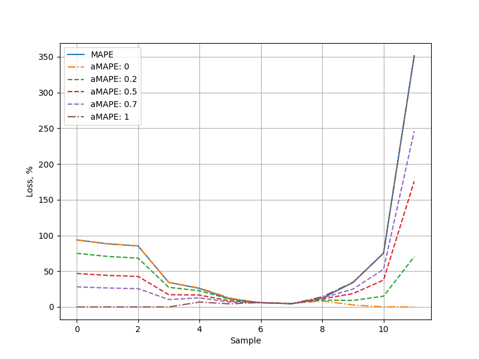

# Solution to the Greenscreens.ai take-home assessment (Jan'24)

## Structure
* [Task 1](#task-1): Description & Solution
* [Task 2](#task-2): Description & Solution
* [Running Instructions](#running-instructions)
* [Directory Structure](#directory-structure)

## Task 1

### Description
You should predict the rate per mile using your model, features etc.

Example code returns the average rate as prediction, it gives 34.85% accuracy.

Rate quality prediction is measured by MAPE (mean absolute percentage error):

$$ MAPE =  \frac{1}{N}  \sum_{i=1}^{N} {\bigg | {1 - \frac{Rate_{predicted}^{i}}{Rate_{real}^{i}}}\bigg | }  \times 100\%  $$

There are three files with data: train.csv, validation.csv (validation set in front of train in terms of date) and test.csv (for your prediction)
We have divided all US territory into KMA (Key Market Regions). These regions are grouped by similar market conditions that are inside each market. Try to enhance the current Rate Engine by pushing knowledge about origin and destination KMA into a model. 
The dataset contains the following features: the number of miles of the route, the type of transport (there are three main types of transport), used for transporting the cargo, the weight of the cargo, the date when the cargo was picked up, the KMA origin point and the KMA destination point.

Try to beat our prediction accuracy (MAPE), we are expecting less than 9%.

Please send an estimate of your validation MAPE, and the predictions for the test.csv and don't forget to attach your code.

### Solution

#### 1. Data Analysis
The basic data analysis was performed using the following script: `data_transformations/data_analysis_basic.py`

Key takeaway notes (beyond the main stats) of this step include:
1. The training set has 80 missing values for the weight
2. There's a fair amount of duplicate rows train (3.5%), test (7.42%), and val(4.9%).
The test has nearly double the amount -> how much is the rate influenced by the day at pickup? time? year?
3. Train & test have weights upto ~190k, whereas val only goes to 70k -> can val be missleading as a result?

#### 2. Data Transformations

#### Dataset: V1

Based on the findings from the previous step, it was decided to perform the following transformations:
* Split pickup date into `hour`, `day`, `month`, `year` and create a new feature - `day of week`;
* `transport_type` was encoded using One-Hot Encoding due to low dimensionality and assumed independence of variables;
* `origin_kma` and `destination_kma` were encoded using label encoding, namely mapping each value to a unique random value. This approach was preferred to using sequential numbers to minimise potential bias or unwanted interdependencies that a model could have learned;
* Original columns that were no longer in use were dropped.

In parallel, a set of data visualisations (available in the `visualisations` folder) was created for each of the files (train, test and validation):
* Correlation Matrices
* Run distributions
* Weight per transport type distributions
* Distance per transport distributions

#### Dataset: V2

Later, another version of the dataset was created that inherited all the aforementioned transformations and introduced an additional one. Namely, a multiplier was applied to the rate column across test and validation files to transform it into an integer. The hope was to reduce potential floating point inaccuracies. However, the testing did not show any noticeable improvement. Thus, V2 was dropped and V1 was used in all experiments described in this write-up.


#### 3. Searching the Model Space

Four models were selected as potential candidates to be implemented in the final solution:
* Linear Regression - mainly as a baseline reference
* Linear Support Vector Regression - The linear version was selected due to the speed constraints applied to a relatively large training set of 250k+ samples. I did attempt to run the full SVR on a GPU using RAPIDS. However, I faced CUDA compatibility issues and had to drop this idea in the interest of time.
* XGBoost
* Histogram-based Gradient Boosting Regression Tree (HGBR) - a more efficient GB algorithm implemented within the sklearn library

Initial experiments were conducted using the full feature set (dataset: V1) and minimal, if any, hyperparameter tuning.

As a result, the following was the model ranking sorted by MAPE, highest to lowest: 
1. HGBR (MAPE: ~14%)
2. XGBoost (MAPE: ~15%)
3. Linear Regression (MAPE: ~30%)
4. Linear Support Vector Regression (MAPE: ~90%)

Due to HGBR having fewer hyperparameters, thus easier to experiment with, and being slightly ahead of the XGBoost, it was decided to explore it first.

#### 4. Searching the Parameter Space
#### Model Parameters
First, I set out a parameter space to explore using Grid Search with a 5-fold CV:

```
{
    "loss": ["gamma"], -> during prior tests gamma loss showed the best results. So in the interest of time, it was decided not to explore other available options 
    
    "max_iter": [5000, 10000, 50000], -> 10k is the maximum number before early stopping is auto-enabled, 50k could work well with a low learning rate
    
    "learning_rate": [0.01, 0.1, 0.5], -> try not to overfit with a low learning rate, try others just in case

    "max_leaf_nodes": [40, 50, 60], -> experiment with increasingly larger trees
}
``````
The results of the search are presented below:


In summary, the two most effective solutions both shared the LR of 0.01 and max_leaf_nodes of 60 with the difference being the number of iterations, 10k (second) or 50k (first). Therefore, these two options were selected to be validated to be used as the final solution.

The script is available at `train_hgbr_search.py`

#### Feature Set
Via a small ablation study (which could have been replaced or confirmed by looking at the feature importance) it was found that all but one feature were valuable, i.e. positively affected the validation score. `pickup_date_day` turned out to be the feature that negatively affected the score, thus it was removed from the final set of features.

#### 5. Fit
Now, it was time to assess the parameter selection using the validation set using the two best sets of parameters from the Grid Search:
* Loss: gamma
* Learning Rate: 0.01
* Max Leaf Nodes: 60
* Max Iterations (trees): 10k and 50k 

To minimise the influence of chance, both 50k and 10k configurations were fitted 20 times and models were saved each time a new best result was shown on a validation set.

The outcomes were as follows:
* 10K. Best MAPE: 8.73%. Average MAPE: 8.92% +-0.11
* 50K. Best MAPE: 8.7%. Average MAPE: 8.93% +-0.15

The greater variance in the 50k case could be explained by the fact that early stopping was auto-enabled which could affect the consistency if the number of final trees could vary slightly from run to run.

The script is available at `train_hgbr_fit.py` and saved models are available in the `trained_models` folder.

Note, since HGBR was able to beat the target score, it was decided not to further explore other models, including XGBoost.

#### 6. Test & Results
Finally, it was time to produce the final set of results. For this, the `test.py` script was created to go through the list of saved models and run the predictions on the test set. As a result, output predictions were saved in the `final_predictions` folder.

The selection of the submission file is always a tricky process as it requires a balanced judgement on the risk of overfitting to the validation set vs the attractiveness of the best score.

In this case, I decided to opt for the solution with the best validation score achieved with the 50k iteration setup. The logic behind it is that although it represents a larger risk of overfitting to the validation score, the 10k alternative is more likely overfitted on the training set as it ran on it for longer (50k was early-stoped). I judged that it is better to overfit on validation since from the assessment of data visualisations the data distribution seems closer between validation and test than between train and test. I may be wrong and will look forward to finding out. 

Note, I did not merge training and validation data before creating the final response. The upside of receiving ~2% more data was not enough to outweigh the downside of having a model that is not validated.

### Update

After the submission of the afore-described solution, the following conclusions were made:
- The best test score (MAPE) was achieved by the solution with the lowest validation score, clearly indicating overfitting to the validation set. This is hardly surprising as selecting the final solution based on the lowest validation score out of 20 validation runs could only end in one result - overfitting.
- The best test score was almost 1% MAPE off the desired 9%

So when faced with the task of improving the test score, I focused on the following:
1. Remove the validation set bias from the final selection.
2. How can achieve a 0.8% improvement to get under 9% on the test set?

### Improvements

So when faced with the task of improving the test score, I focused on the following:
1. Remove the validation set bias from the final selection.
2. How can achieve a 0.8% improvement to get under 9% on the test set?

To address the noticeable test set performance gap (~1% vs desired 9% MAPE), we can try several approaches. Firstly, we can ingest more data to improve prediction quality. Fortunately, we have an extra 5,000 validation set samples that we can use. Secondly, we can improve the model itself. Thirdly, we can expand the feature set we use for prediction. Finally, we can try introducing creative pre/post processing techniques to help bridge the gap.

As for model improvements, I tried a few more models, including a KNN (`model_search/train_knn.py`), AdaBoost, and RandomForest (scripts not saved) but none of them were very promising with the best of them showing around 10.5-11% MAPE. So due to concerns about the time required to fine-tune potential candidates, I decided to explore other options first.

Working with features, I wasn't fully convinced about the existing feature selection. To address this, I first analysed the feature importance of all 12 features using the permutation importance measure (`train_hgbr_fit_test_features.py`). It showed (`visualisations/feature_importance_...png`) that despite valid_miles, origin and destination are by far the most important ones, all 12 features have a positive effect when tested with a validation set. Then, I double-checked that with an ablation study where I fixed a reasonably sized model (500 trees) to manage the training time and tried removing individual features and sub-sets of features. Both experiments showed that the best result is achieved when all the features are used. Hence, I returned the previously omitted calendar day feature.

As for the creative pre/post-processing techniques, ensembling was employed to improve generalisation and gain the desired performance boost. A multi-model ensemble seemed the most promising option, as a combination of models with compatible performance but a different approach to achieving this result (eg KNN or an SVM) as compared to HGBR often yields superior performance. However, as previously mentioned, no candidates were found of such models that wouldn't require a long hyperparameter search. 
Thus, it was decided to experiment with data-level ensembling, which also helped address the first focus point, preventing overfitting. Two options were proposed: (i) brute-force averaging of predictions across 20 runs (`train_hgbr_test_average.py`) and (ii) utilising a Bagging Regressor (`train_hgbr_test_bagging.py`) that essentially does a similar thing but in a more elegant and statistically correct way.

Finally, I trained regressors using the full set of labelled data, ie the combination of training and validation sets.

In conclusion, the following measures were taken to address the two focus areas outlined above:
1. Expanding the feature set by returning the previously omitted calendar day feature
2. Introducing more training data by utilising the validation set
3. Employing ensembles to improve generalisation and, hopefully, performance.

#### Results
The proposed improvements yielded the desired result of sub-9% MAPE on the test set achieved with the averaging version of the updated solution.

#### 9. Future Work
It would be interesting to explore: 
* RAPIDS (https://rapids.ai/#quick-start) and GPU accelerated solutions would give a chance to try more models and parameters quicker.
* The effect of more features: weather, traffic, time of arrival/trip duration.
* Dockerise the solution for reproducibility.


## Task 2 

### Description

Think and propose your version of an asymmetric MAPE-like metric. This asymmetry should be adjustable through the introduction of an additional parameter, allowing for fine-tuning of the metric's sensitivity to overestimations and underestimations. Consider the advantages, disadvantages, and limitations of using such a metric.

### Solution

First, let's establish the over and under-estimation conditions.

Let $Rate_{real}$ represent real rates and $Rate_{predicted}$ represent the predicted rates.
Then, the conditions could be represented as follows:

$Rate_{real} - Rate_{predicted} < 0$ for overestimation; and

$Rate_{real} - Rate_{predicted} > 0$ for underestimation.

To allow the asymmetric behaviour for adjustable sensitivity to either over or under-estimation, a parameter alpha ($\alpha$) could be introduced to control the weighting given to each of the cases accordingly:

$$
\begin{aligned}
    \alpha * \bigg | { {\frac{Rate_{real}-Rate_{predicted}}{Rate_{real}}}}\bigg | \quad for \ real - predicted <0\\ 
    and\quad(1 - \alpha) * \frac{Rate_{real}-Rate_{predicted}}{Rate_{real}}  \quad for \ real - predicted \geq0\\ 
\end{aligned}
$$

This can be represented in an equation (simplified) presented below:

$$ 
aMAPE =  \frac{1}{N}  \sum_{i=1}^{N} {|\alpha*over + (1-\alpha)*under |}  \times 100\%  
$$

This means that adjusting $\alpha$ would change the behaviour of the cost function as follows:

* $\alpha$ > 0.5 increase the penalty for overestimation
* $\alpha$ < 0.5 increase the penalty for underestimation
* $\alpha$ = 0.5 force symmetric behaviour

This equation has been coded up in full and can be found in `utils/loss_functions.py::amape_loss`.
A script comparing aMAPE and MAPE can be found at `t2_visualise_losses.py` as well as its output which is saved as `visualisations/losses.png`. 

This image represents a diagram as shown below, it compares MAPE and aMAPE loss behaviour depending on conditions. Samples 0-4 represent (mostly severe) underestimation, 5-8 (balanced estimation) and 9-12 severe overestimation.



This diagram helps us demonstrate the effect that adjustment of the parameter $\alpha$ has on the behaviour of the aMAPE loss function. We see that in the edge cases such as $\alpha$=0 or $\alpha$=1, aMAPE loss repeats the MAPE line exactly for the underestimation and overestimation regimes, respectively, while showing 0% loss for the opposite regime. This behaviour is undesirable in real cases as it prevents any analysis beyond the respective operating window. However, a well-balanced $\alpha$ could help adjust the system depending on the needs of the application making the loss more or less sensitive to either over or under estimations. However, this flexibility comes at the cost of the aMAPE being harder to interpret and communicate as it is not anymore a straightforward ratio as compared to MAPE. Furthermore, the selection of $\alpha$ becomes critical as it can lead to unwanted biases.

In summary, the following list represents the advantages and disadvantages of aMAPE vs MAPE:
* Advantages:
    * Flexibility
    * Business Relevance - set up your system to prefer either over or under predictions depending on the "cost to business", e.g. it may be better to have extra cash saved vs being just over the available limit
    * Shoots off less for very incorrect predictions
* Disadvantages:
    * Interpretability - may be harder to explain
    * Parameter Selection - poorly selected $\alpha$ may lead to unwanted biases

## Running Instructions

The code was written and only tested with `python version 3.9.18`

It is recommended to run the code using a virtual environment that can be installed as follows:

1. `python -m venv venv`
2. `cd venv/bin`
3. `source activate`
4. `cd ../..`

All required libraries can be installed as shown below:
1. `pip install --upgrade pip`
2. `pip install -r requirements.txt`

## Directory Structure
```
Root
│
Folders
├── dataset
│   ├── test.csv
│   ├── train.csv
│   ├── validation.csv
│   ├── transformed_v1 -> V1 of the dataset
│   └── transformed_v2 -> V2 of the dataset
├── data_transformations -> data analysis and transformations scripts
├── final_predictions
├── model_search -> Task 1 Step 3: Searching the Model Space
├── supporting_materials -> materials used in README
├── utils
├── visualisations
│
Main Scripts
├── t2_visualise_losses.py
├── test.py
├── trained_models
├── train_hgbr_fit.py
├── train_hgbr_search.py
│
Other
├── README.md
├── requirements.in
└── requirements.txt
```
